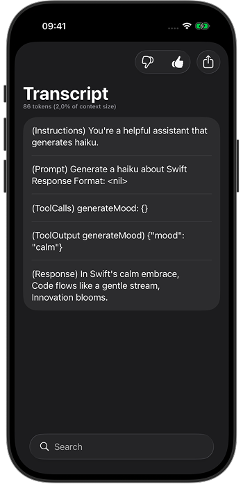
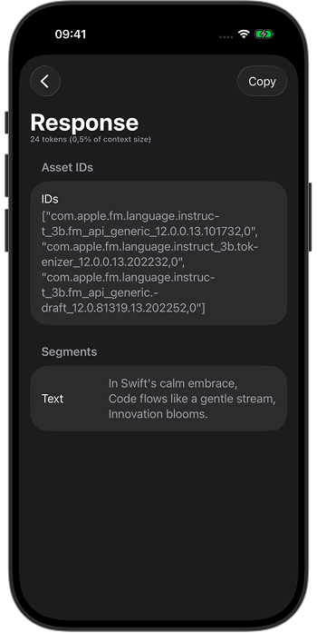

# TranscriptDebugMenu

[](https://swiftpackageindex.com/artemnovichkov/TranscriptDebugMenu/documentation/transcriptdebugmenu)
[](https://swiftpackageindex.com/artemnovichkov/TranscriptDebugMenu)
[](https://swiftpackageindex.com/artemnovichkov/TranscriptDebugMenu)

A SwiftUI library for inspecting, searching, exporting, and reporting feedback about `LanguageModelSession` transcripts.

<p align="center">
  
  
</p>

## Description

TranscriptDebugMenu is a lightweight SwiftUI component designed to help developers inspect language model sessions. It displays transcript metadata, context-window metrics, token usage, attachments, generation options, tool calls, reasoning, and structured output.

## Features

- View, search, and filter every transcript entry type;
- Inspect formatted structured content, metadata, tool schemas, attachments, reasoning, and token usage;
- Calculate context-window usage with an explicitly configured model-specific provider;
- Copy values or export the complete transcript as formatted JSON;
- Create detailed `LanguageModelFeedback` for Apple's Feedback Assistant.

## Installation

Version 2.0 is in beta. Select the `2.0.0-beta.1` tag from [Releases](https://github.com/artemnovichkov/TranscriptDebugMenu/releases/tag/2.0.0-beta.1) in Xcode, or use the exact version below in `Package.swift`.

Add TranscriptDebugMenu to your project using Swift Package Manager:

1. In Xcode, go to **File → Add Package Dependencies...**
2. Enter the repository URL:
   ```
   https://github.com/artemnovichkov/TranscriptDebugMenu
   ```
3. Choose the version you want to use
4. Add the package to your target

Alternatively, add it to your `Package.swift` file:

```swift
dependencies: [
    .package(url: "https://github.com/artemnovichkov/TranscriptDebugMenu", exact: "2.0.0-beta.1")
]
```

## Usage

> Check out [Using TranscriptDebugMenu](https://artemnovichkov.github.io/TranscriptDebugMenu/tutorials/transcriptdebugmenu/usingtranscriptdebugmenu) tutorial for a step-by-step guide.

Import the library and use the transcript menu modifier on any SwiftUI view:

```swift
import SwiftUI
import FoundationModels
import TranscriptDebugMenu

struct ContentView: View {
    @State private var showTranscript = false
    private static let model = SystemLanguageModel.default
    @State private var session = LanguageModelSession(model: ContentView.model)
    
    var body: some View {
        VStack {
            Button("Show Transcript Menu") {
                showTranscript = true
            }
        }
        .transcriptDebugMenu(
            session,
            isPresented: $showTranscript,
            configuration: .systemModel(Self.model)
        )
    }
}
```

## Requirements

- iOS 26.0+ / macOS 26.0+ / Mac Catalyst 26.0+ / visionOS 26.0+
- Swift 6.4+
- Xcode 27.0+

## Context metrics

Pass the same `SystemLanguageModel` instance used by the session:

```swift
let model = SystemLanguageModel(useCase: .contentTagging)
let session = LanguageModelSession(model: model)

content
    .transcriptDebugMenu(
        session,
        isPresented: $showTranscript,
        configuration: .systemModel(model)
    )
```

Omit `configuration` for dynamic, cloud, or custom models without a reliable token counter: `.transcriptDebugMenu(session, isPresented: $showTranscript)`. No model is assumed. The context progress section is hidden, while the session's reported usage remains available on iOS 27 and related platforms.

System-model context metrics require iOS 26.4, macOS 26.4, Mac Catalyst 26.4, or visionOS 26.4. On earlier supported OS versions, or if counting fails, the Context section is hidden. Usage is reported by the session and is separate from context-window consumption. Attachments, reasoning, and other OS 27 diagnostics appear when supported by the OS and present in the transcript.

For the API changes, see [Migrating to 2.0](Sources/TranscriptDebugMenu/Documentation.docc/MigratingTo2.0.md).

## Export and feedback

Open **Export** to copy or share the full transcript as formatted JSON. Search only changes the visible entries; exports include the entire transcript.

In **Export**, choose **Report Feedback…** to choose a sentiment, select issues and add explanations, and enter the desired response. **Share** in the feedback form exports a `LanguageModelFeedback` attachment for Feedback Assistant. Sharing the file does not submit a report automatically.

## Contributing

Contributions are welcome! Please feel free to submit a Pull Request. For major changes, please open an issue first to discuss what you would like to change.

1. Fork the repository
2. Create your feature branch (`git checkout -b feature/amazing-feature`)
3. Commit your changes (`git commit -m 'Add some amazing feature'`)
4. Push to the branch (`git push origin feature/amazing-feature`)
5. Open a Pull Request

## Author

Artem Novichkov, https://artemnovichkov.com/

## License

The project is available under the MIT license. See the [LICENSE](./LICENSE) file for more info.
