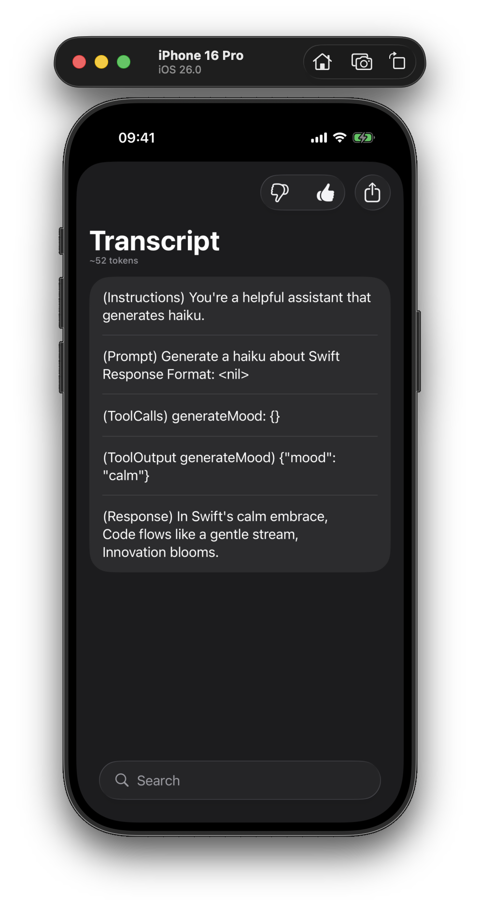

# TranscriptDebugMenu

[](https://swift.org)
[](https://developer.apple.com)
[](https://swift.org/package-manager/)

A SwiftUI library that provides a debug menu for viewing, analyzing, and copying `LanguageModelSession` transcripts with approximate token counting.

<p align="center">
  
  
</p>

## Description

TranscriptDebugMenu is a lightweight SwiftUI component designed to help developers debug and inspect language model session transcripts. It provides an easy-to-use interface for viewing conversation entries, displaying approximate token counts for both individual entries and entire transcripts, and copying content to the clipboard for further analysis.

## Features

- View and copy transcript entries to clipboard;
- Search and filter transcript entries by type;
- Navigate detailed views for each transcript entry;
- Display approximate token counts for entries and full transcripts;
- Generate `LanguageModelFeedback` JSON for Apple's Feedback Assistant.

## Installation

Add TranscriptDebugMenu to your project using Swift Package Manager:

1. In Xcode, go to **File → Add Package Dependencies...**
2. Enter the repository URL:
   ```
   https://github.com/artemnovichkov/TranscriptDebugMenu
   ```
3. Choose the version you want to use
4. Add the package to your target

Alternatively, add it to your `Package.swift` file:

```swift
dependencies: [
    .package(url: "https://github.com/artemnovichkov/TranscriptDebugMenu", from: "1.6.0")
]
```

## Usage

> Check out [Using TranscriptDebugMenu](https://artemnovichkov.github.io/TranscriptDebugMenu/tutorials/transcriptdebugmenu/usingtranscriptdebugmenu) tutorial for a step-by-step guide.

Import the library and use the transcript menu modifier on any SwiftUI view:

```swift
import SwiftUI
import FoundationModels
import TranscriptDebugMenu

struct ContentView: View {
    @State private var showTranscript = false
    @State private var session = LanguageModelSession()
    
    var body: some View {
        VStack {
            Button("Show Transcript Menu") {
                showTranscript = true
            }
        }
        .transcriptDebugMenu(session, isPresented: $showTranscript)
    }
}
```

## Requirements

- iOS 26.0+ / macOS 26.0+ / visionOS 26.0+
- Swift 6.2+
- Xcode 26.0+

## Contributing

Contributions are welcome! Please feel free to submit a Pull Request. For major changes, please open an issue first to discuss what you would like to change.

1. Fork the repository
2. Create your feature branch (`git checkout -b feature/amazing-feature`)
3. Commit your changes (`git commit -m 'Add some amazing feature'`)
4. Push to the branch (`git push origin feature/amazing-feature`)
5. Open a Pull Request

## Author

Artem Novichkov, https://artemnovichkov.com/

## License

The project is available under the MIT license. See the [LICENSE](./LICENSE) file for more info.
